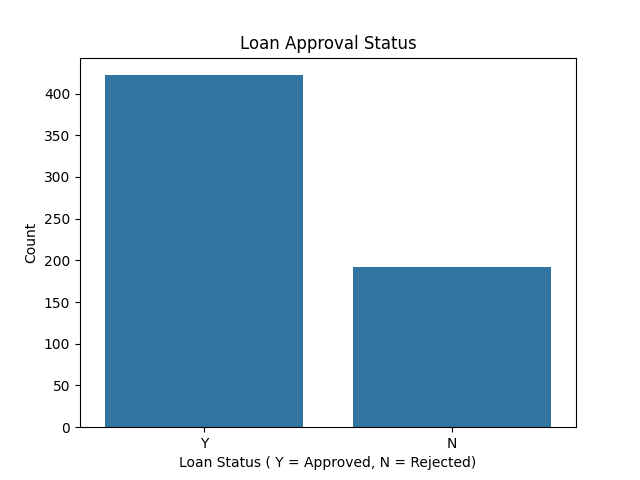
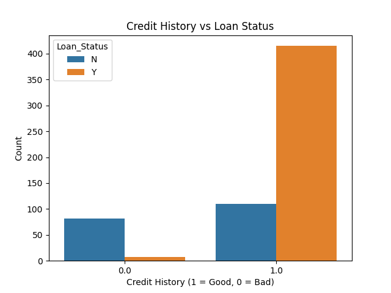
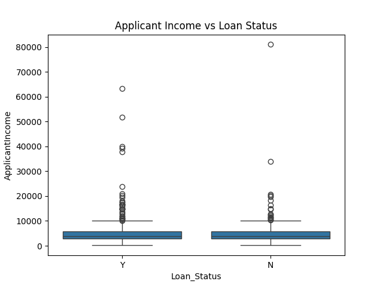
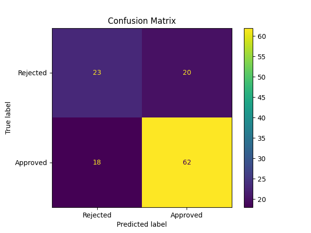

# Credit Risk Prediction

A classification project built during my Data Science & Analytics Internship at DevelopersHub Corporation. The goal is to predict whether a loan application will be approved or rejected based on applicant information like income, credit history, and loan amount.

---

## Dataset

**Loan Prediction Dataset** available on [Kaggle](https://www.kaggle.com/datasets/altruistdelhite04/loan-prediction-problem-dataset)

| Column | Description |
|--------|-------------|
| Gender | Male / Female |
| Married | Applicant marital status |
| Dependents | Number of dependents |
| Education | Graduate / Not Graduate |
| Self_Employed | Yes / No |
| ApplicantIncome | Monthly income of applicant |
| CoapplicantIncome | Monthly income of co-applicant |
| LoanAmount | Loan amount requested |
| Loan_Amount_Term | Term of loan in months |
| Credit_History | 1 = Good, 0 = Bad |
| Property_Area | Urban / Semiurban / Rural |
| **Loan_Status** | **Target - Y = Approved, N = Rejected** |

614 rows. Missing values present in several columns.

---

## What I Did

1. **Loaded and inspected the dataset**  Checked shape, column types, and first few rows
2. **Identified missing values**  Credit_History had 50 missing, Self_Employed had 32
3. **Fixed missing values** Median for numeric columns, mode for categorical columns
4. **Visualized key patterns:**
   - Count plot - overall loan approval vs rejection distribution
   - Count plot - credit history vs loan status (good credit = much higher approval rate)
   - Box plot - applicant income vs loan status
5. **Encoded categorical columns** using LabelEncoder, dropped Loan_ID
6. **Trained a Decision Tree Classifier** - 80/20 train/test split
7. **Evaluated** using accuracy score and confusion matrix

---

## Results

| Metric | Value |
|--------|-------|
| Accuracy | 69.11% |

The model correctly predicted loan status 69% of the time on unseen data. Credit history was the most influential factor, applicants with good credit history were approved at a significantly higher rate.

---

## Visualizations









---

## Key Findings

- Applicants with good credit history (1) had a much higher approval rate than those with bad credit (0)
- Income alone is not a strong predictor as high earners were still rejected in many cases
- The dataset is imbalanced — more approvals than rejections, which affects model performance

---

## Libraries Used

- pandas
- matplotlib
- seaborn
- scikit-learn

---

## How to Run

1. Download `train.csv` from [Kaggle](https://www.kaggle.com/datasets/altruistdelhite04/loan-prediction-problem-dataset)
2. Place it in the same folder as the notebook
3. Install dependencies:
```
pip install pandas matplotlib seaborn scikit-learn jupyter
```
4. Open and run `crp.ipynb`

---

*This project was completed as part of the DevelopersHub Corporation Data Science & Analytics Internship.*
